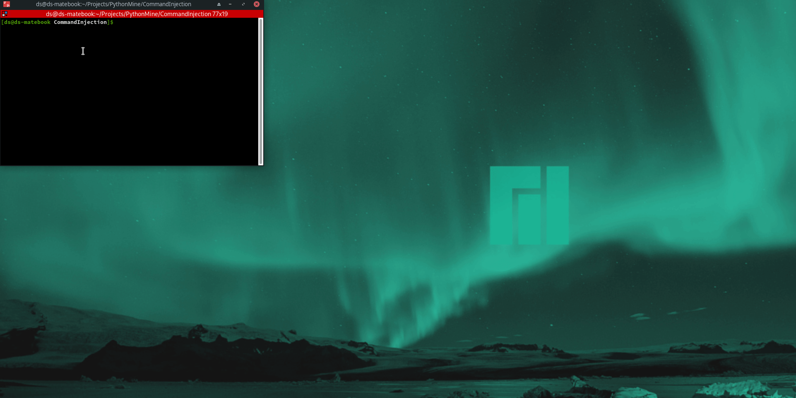

# Test XVWA Command Injection

## Description:
### Selenium program to test XVWA web application for command injection vulnerability.
### Prerequisites
1. pip3 install -U selenium
2. Have firefox installed
3. Have the geckodriver in your system path https://github.com/mozilla/geckodriver/releases
4. Download and run xvwa in a docker https://github.com/s4n7h0/xvwa ---> https://github.com/tuxotron/xvwa_lamp_container (follow instructions)

### Demo Gif
